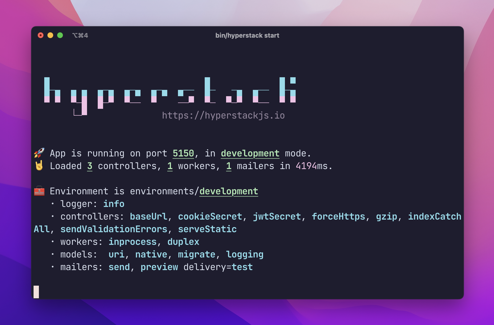

# Quick Start

Before you start, make sure you have `sqlite` and `postgres` libraries available. Both of these aren't mandatory but strongly recommended.

With _Hyperstack_, you'll use `sqlite` for sketching out ideas, but `postgres` is what you'll use in production.

## Install OS libraries

On **macOS** you can use the [Postgres.app](https://postgres.app/) or Homebrew:

```
brew install postgres
```

For **Linux** you can use [a suitable package manager](https://www.postgresguide.com/setup/install/) for both Postgres and sqlite.


## Generate your app


Everything here is `yarn` or `pnpm` driven, because that's what we use to build _Hyperstack_. But if you use `npm`, that's OK too. Here we go:

```
yarn create hyperstack
```

Or,

```
pnpm create hyperstack
```

At this point feel free to swap `yarn` with `pnpm` through out the docs if you prefer.

This will generate an app for you. The app should contain a few **models, controllers and a full test suite**.


```
cd my-hyperstack-app
pnpm install
```

This will fetch all the dependencies for you. There are many, because _Hyperstack_ does:

* **API serving, routing**, and export to various standards (OpenAPI)
* **Built in JWT based authentication** logic and infra
* Data and **data modeling** with Sequelize
* **Background jobs** with bullmq
* **Mailers with node-mailer** and some development goodies (auto email preview)
* **Ad-hoc tasks** (for cron and others)
* Sets up a magical **REPL for day to day productivity**
* Uses a **generator framework** to accelerate all the boring tedious stuff you need to do
* Includes a **testing framework for models, requests, workers and more** to make testing a breeze
* And much much more

## Run your app

```
$ bin/hyperstack start
```

This starts the app. In development mode (the mode you're in right now) it will **automatically build database tables** and everything that's needed while booting up if it doesn't exist yet.

You'll know it worked when you'll get a short summary of everything that's active:



On a new terminal, let's see what we've got:


```
$ bin/hyperstack
hyperstack <command>

Commands:
  hyperstack migrate   migrate a database                           [aliases: m]
  hyperstack generate  generate code                                [aliases: g]
  hyperstack seed      seed a database                              [aliases: d]
  hyperstack routes    display app routes                           [aliases: r]
  hyperstack start     start a server, worker or both (default both)[aliases: s]
  hyperstack portal    open a portal to your app as a REPL          [aliases: p]
  hyperstack tasks     run a task                                   [aliases: t]
```


We want to open up a _portal_, which is a way to develop interactively with _Hyperstack_, but first, let's seed the database with some initial fun data:


```
$ bin/hyperstack seed
```

You'll see something like this (note that I like to have SQL logs on, so you see some raw queries in the output):


```
$ bin/hyperstack seed
INFO [2022-01-07 07:46:07.893 +0000]: workers: [in-process, duplex] 1 workers, 1 mailers
Executing (default): SELECT count(*) AS `count` FROM `Users` AS `User` WHERE `User`.`username` = 'alex@example.com';
Executing (default): INSERT INTO `Users` (`id`,`pid`,`username`,`password`,`name`,`emailVerificationToken`,`emailVerificationSentAt`,`emailVerifiedAt`,`createdAt`,`updatedAt`) VALUES (NULL,$1,$2,$3,$4,$5,$6,$7,$8,$9);
Executing (default): INSERT INTO `Notes` (`id`,`pid`,`title`,`content`,`ownerId`,`createdAt`,`updatedAt`) VALUES (NULL,$1,$2,$3,$4,$5,$6);
Executing (default): SELECT count(*) AS `count` FROM `Users` AS `User` WHERE `User`.`username` = 'sammy@example.com';
Executing (default): INSERT INTO `Users` (`id`,`pid`,`username`,`password`,`name`,`emailVerificationToken`,`emailVerificationSentAt`,`emailVerifiedAt`,`createdAt`,`updatedAt`) VALUES (NULL,$1,$2,$3,$4,$5,$6,$7,$8,$9);
Executing (default): INSERT INTO `Notes` (`id`,`pid`,`title`,`content`,`ownerId`,`createdAt`,`updatedAt`) VALUES (NULL,$1,$2,$3,$4,$5,$6);
INFO [2022-01-07 07:46:08.292 +0000]: seed: done
(base)
```


And now:

```
$ bin/hyperstack portal
⚡[development] >
```

The _portal_ is a REPL that drops you **right into the current app**. You can use the models in your app to view live data, insert data or perform various operations on the model classes themselves.

```
⚡[development] > .models
Note
User

⚡[development] > await User.findOne()
User {
  dataValues: {
    id: 1,
    pid: '10c9321a-eaa3-4129-84e8-300e9372a5d2',
    username: 'alex@example.com',
    name: 'Alex Van Halen',
    :
    :
```

But now, let's make it prettier:


```
⚡[development] > to([await User.findOne()])
pid                                  | username         | name
------------------------------------------------------------------------
c10c9321a-eaa3-4129-84e8-300e9372a5d2 | alex@example.com | Alex Van Halen
```

We used `to` which is short for `t`able from `o`bject that end users see. 

You can also try `tr` which is `t`able from `r`aw object (that the system sees, which includes stuff like hashed password for the user).

Moving on, you can quickly **list the active routes**:


```
⚡[development] > .routes
Auth /auth
  POST	/auth/login
  POST	/auth/register
  GET	/auth/verify
  POST	/auth/forgot
  POST	/auth/reset
  
  :
  :
```

Let's make a request. I'm using `httpie` so I can get a snippet for that:


```
> .routes httpie
⚡[development] > .routes httpie
Auth /auth
  POST	/auth/login

Shell + Httpie
http POST http://localhost:5150/auth/login

  POST	/auth/register

Shell + Httpie
http POST http://localhost:5150/auth/register

  GET	/auth/verify

Shell + Httpie
http GET http://localhost:5150/auth/verify

  POST	/auth/forgot

Shell + Httpie
http POST http://localhost:5150/auth/forgot

  POST	/auth/reset

Shell + Httpie
http POST http://localhost:5150/auth/reset
```

Try it out! you have a live app!

## Building stuff quickly

_Hyperstack_ includes a generator framework (called [Hygen](https://github.com/jondot/hygen)) and a built-in set of templates to accelerate getting started.

Let's add full CRUD abilities with a new entity: `Article`.

```
$ bin/hyperstack g scaffold article title:string body:text

Loaded templates: gen/dist/templates
       added: src/test/requests/articles/sanity.spec.ts
       added: src/app/controllers/articles.ts
       added: src/config/db/migrate/1337_article.js
       added: src/test/models/article.spec.ts
       added: src/app/models/article.ts
      inject: src/app/controllers/index.ts
      inject: src/app/controllers/index.ts
      inject: src/app/models/index.ts
✔      shell: running eslint
       shell: yarn eslint --fix src/app/models/*.ts src/app/controllers/*.ts src/test/models/*.spec.ts src/test/requests/articles/*.spec.ts src/config/db/migrate/*.js
```

This generates:

* Model
* Controller (CRUD, without delete)
* Test suite for model and controller
* Performs linting on the generated material


**Run your app again:**

```
bin/hyperstack start
```

And perform requests (I'm using [xh](https://github.com/ducaale/xh) but you can use [httpie](https://httpie.io/) which is similar, or anything you like).

**List:**

```
$ xh -j -b localhost:5150/articles
{
    "articles": []
}
```
**Create:**

```
$ xh -j -b localhost:5150/articles title="hello hyperstack" body="EVH rocks"
{
    "article": {
        "title": "hello hyperstack",
        "body": "EVH rocks"
    }
}
```

Take a look at the list again:

```
$ xh -j -b localhost:5150/articles
{
    "articles": [
        {
            "title": "hello hyperstack",
            "body": "EVH rocks"
        }
    ]
}
```

**Update**:

If you'll notice, up until now, every time we've got an `Article` entity, we don't have its ID passed to us on the wire.

Let's add it.


Edit `src/app/models/article.ts` and add `id` to the `toJSON()` serialization function that `Article` contains.

```ts
  //..
  toJSON() {
    const { title, body, id } = this.get() as any
    return {
      id,
      title,
      body,
    }
  }
```

`toJSON()` is your way of _explicitly_ controlling what makes it out to the world from your data - it's opt-in rather than opt-out. This is security by design.


And now we've got an ID to use in our updates:

```
$ xh -j -b localhost:5150/articles
{
    "articles": [
        {
            "id": 2,
            "title": "hello hyperstack",
            "body": "EVH rocks"
        }
    ]
}
```

Issue an update request:

```
$ xh -j -b localhost:5150/articles/2 title="hello hyperstack" body="Eddie rocks"
{
    "article": {
        "id": 2,
        "title": "hello hyperstack",
        "body": "Eddie rocks"
    }
}
```

And just to double check, let's fetch articles again:

```
$ xh -j -b localhost:5150/articles
{
    "articles": [
        {
            "id": 2,
            "title": "hello hyperstack",
            "body": "Eddie rocks"
        }
    ]
}
```

We don't generate `DELETE` by default, out of safety. Let's add that now.


Here's your new controller as it stands right now:


```ts
import { Controller, Get, Post, notfound, ok, requires } from 'hyperstack'
import type { Request } from 'hyperstack'
import { z } from 'zod'
import { Article } from '../models/article'

const requireArticleParams = requires(
  z.object({
    title: z.string(),
    body: z.string(),
  })
)
const requireArticleId = requires(z.object({ id: z.string() }))

@Controller('articles')
export class ArticlesController {
  async getArticle(req: Request) {
    const article = await Article.findOne({
      where: requireArticleId(req.params),
    })
    if (!article) {
      throw notfound('article not found')
    }
    return article
  }

  @Get()
  async list() {
    const articles = await Article.findAll()
    return ok({ articles })
  }

  @Post()
  async create(req: Request) {
    const article = await Article.create(requireArticleParams(req.body))
    return ok({ article })
  }

  @Get(':id')
  async get(req: Request) {
    const article = await this.getArticle(req)
    return ok({ article })
  }

  @Post(':id')
  async update(req: Request) {
    const article = await this.getArticle(req)
    await article.update(requireArticleParams(req.body))
    return ok({ article })
  }
}
```

And let's add a `@Delete` action at the bottom:

```ts
  // :
  // :
  @Post()
  async create(req: Request) {
    const article = await Article.create(requireArticleParams(req.body))
    return ok({ article })
  }

  // don't forget to import {Delete} from 'hyperstack'
  @Delete(':id')
  async remove(req: Request) {
    const article = await this.getArticle(req)
    await article.destroy()
    return ok({ deleted: true })
  }
}
```

And make the `DELETE` request:

```
$ xh -j -b DELETE localhost:5150/articles/2
{
    "deleted": true
}
```

Boom, it's gone:

```
$ xh -j -b localhost:5150/articles
{
    "articles": []
}
```

Done!


:::info If you take a look at the controller again, we can't help it but mentioning that we're doing security by default again: look at the strong parameters and all that nice stuff.


And here's your new model, completely generated:

```ts
import {
  HyperModel,
  Schema,
} from 'hyperstack'
const { 
  AllowNull,
  Column,
  DataType,
  Table,
} = Schema

@Table
class Article extends HyperModel<Partial<Article>> {
  @Column
  title: string

  @Column(DataType.TEXT)
  body: string

  toJSON() {
    const { id, title, body } = this.get() as any
    return {
      id,
      title,
      body,
    }
  }
}
export { Article }
```

Again, **security by default**. We're explicitly naming fields to be serialized to the outside world in `toJSON()`.

And here's an automatically generated request test (in `test/requests/articles/sanity.spec.ts`):

```ts
import { test } from '@hyperstackjs/testing'
import { root } from '../../../config/settings'
import { appContext } from '../../../app'

const {
  requests,
  matchers: { matchRequestWithSnapshot },
} = test(root)

describe('requests', () => {
  describe('/articles', () => {
    requests('all', async (request) => {
      const { Article } = appContext.models()
      await Article.create({
        title: 'string',
        body: 'some text',
      })

      await matchRequestWithSnapshot(200, request().get(`/articles`))
    })
  })
})
```

The testing framework takes care of booting the app, setting up an ad-hoc server, cleaning the database, syncing migrations and more, all before a single test runs. It makes testing fun again if you don't have to code all that infrastructure.

That's it!

Next, let's review what's in a _Hyperstack_ app.
